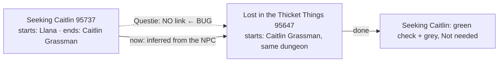

# flowchart

Captured 2026-11-18T20:02:04.118Z - run r-20261118-205800-fed7

```mermaid
flowchart LR
    S["Seeking Caitlin 95737<br/>starts: Llana · ends: Caitlin Grassman"] -. "Questie: NO link ← BUG" .-> T["Lost in the Thicket Things 95647<br/>starts: Caitlin Grassman, same dungeon"]
    S -->|"now: inferred from the NPC"| T
    T -->|"done"| G["Seeking Caitlin: green check + grey, Not needed"]
```
