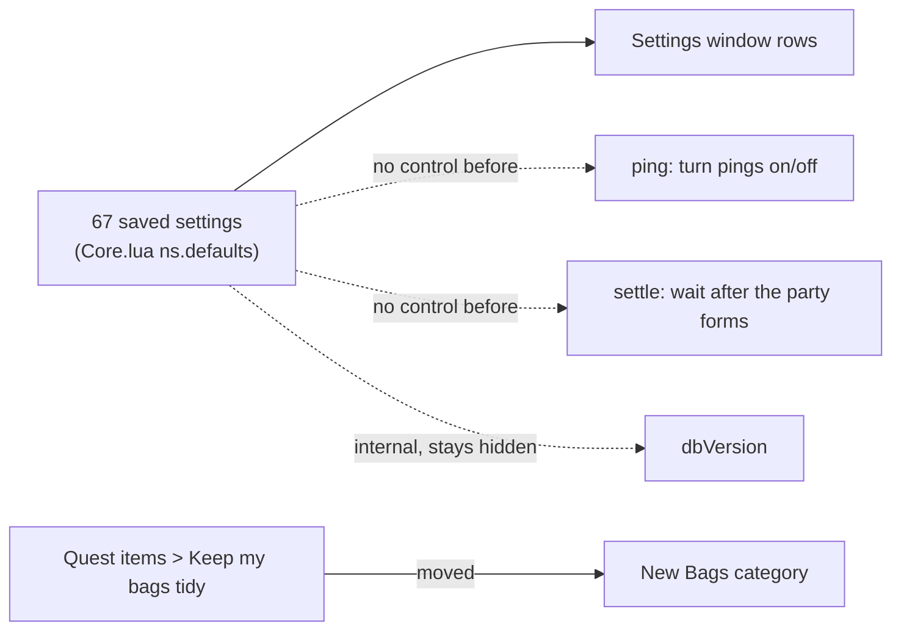

# flowchart

Captured 2026-11-18T19:12:05.560Z - run r-20261118-200711-0869

```mermaid
flowchart LR
    D["67 saved settings<br/>(Core.lua ns.defaults)"] --> S["Settings window rows"]
    D -. no control before .-> P["ping: turn pings on/off"]
    D -. no control before .-> T["settle: wait after the party forms"]
    D -. internal, stays hidden .-> V[dbVersion]
    QI["Quest items > Keep my bags tidy"] -->|moved| B["New Bags category"]
```
