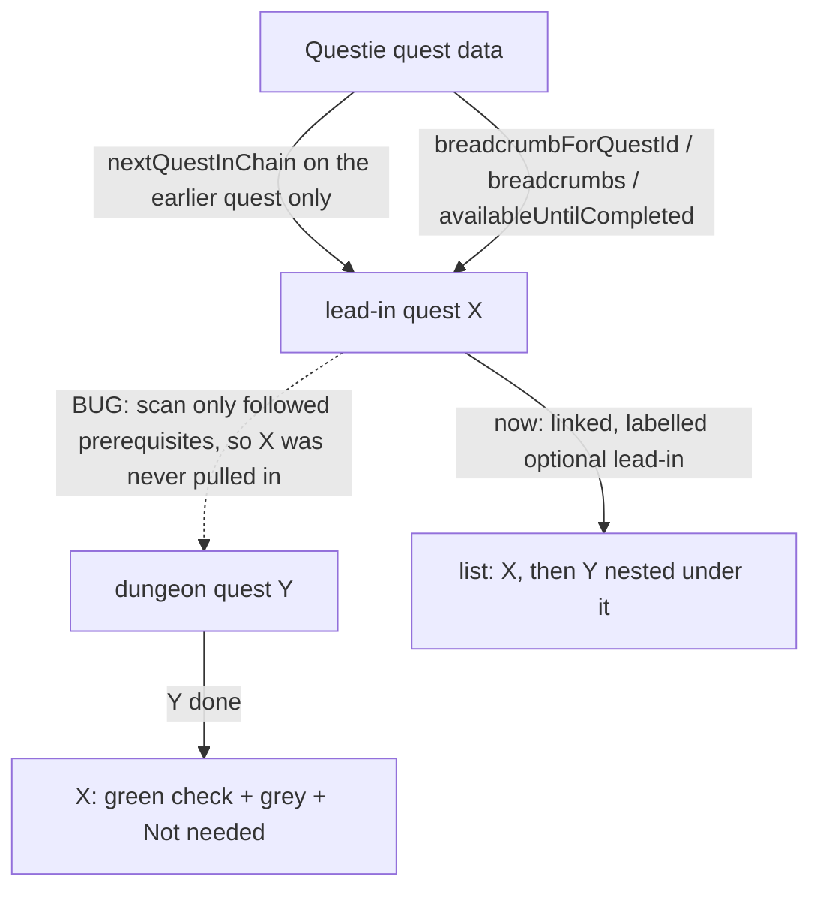

# flowchart

Captured 2026-11-18T11:27:03.695Z - run r-20261118-121921-6159

```mermaid
flowchart TD
    Q[Questie quest data] -->|"nextQuestInChain on the earlier quest only"| X[lead-in quest X]
    Q -->|"breadcrumbForQuestId / breadcrumbs / availableUntilCompleted"| X
    X -. "BUG: scan only followed prerequisites, so X was never pulled in" .-> Y[dungeon quest Y]
    X -->|"now: linked, labelled optional lead-in"| L[list: X, then Y nested under it]
    Y -->|"Y done"| G[X: green check + grey + Not needed]
```
