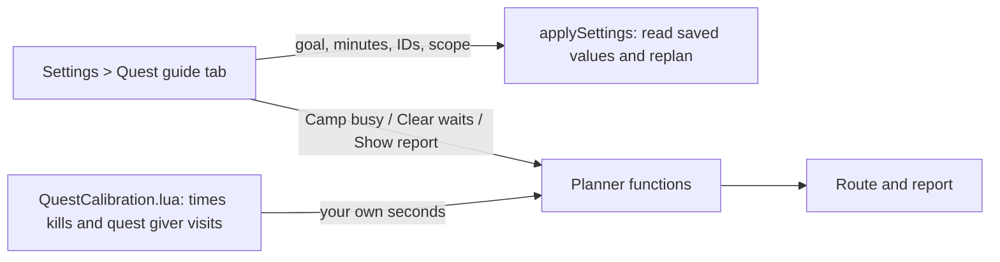

# flowchart

Captured 2026-11-18T07:12:56.219Z - run r-20261118-080508-6f18

```mermaid
flowchart LR
    T[Settings > Quest guide tab] -->|goal, minutes, IDs, scope| A[applySettings: read saved values and replan]
    T -->|Camp busy / Clear waits / Show report| P[Planner functions]
    K[QuestCalibration.lua: times kills and quest giver visits] -->|your own seconds| P
    P --> R[Route and report]
```
