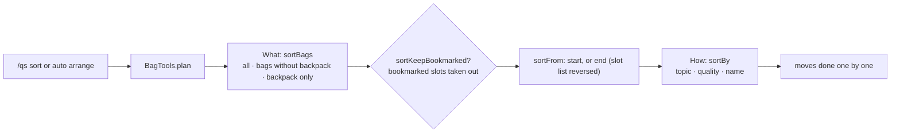

# flowchart

Captured 2026-11-18T19:23:18.602Z - run r-20261118-201922-991d

```mermaid
flowchart LR
    S["/qs sort or auto arrange"] --> P[BagTools.plan]
    P --> W["What: sortBags<br/>all · bags without backpack · backpack only"]
    W --> K{"sortKeepBookmarked?<br/>bookmarked slots taken out"}
    K --> F["sortFrom: start, or end (slot list reversed)"]
    F --> O["How: sortBy<br/>topic · quality · name"]
    O --> M[moves done one by one]
```
