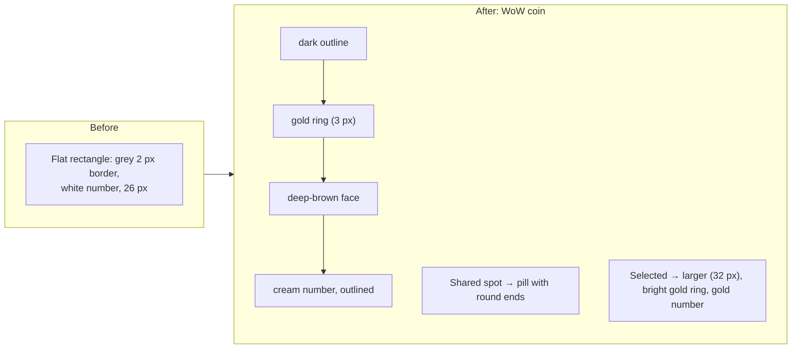

# flowchart

Captured 2026-11-18T19:22:49.544Z - run r-20261118-201826-1bcb

```mermaid
flowchart LR
  subgraph Before["Before"]
    A["Flat rectangle: grey 2 px border,<br/>white number, 26 px"]
  end
  subgraph After["After: WoW coin"]
    O["dark outline"] --> R["gold ring (3 px)"] --> F["deep-brown face"] --> N["cream number, outlined"]
    P["Shared spot → pill with round ends"]
    S["Selected → larger (32 px), bright gold ring, gold number"]
  end
  Before --> After
```
