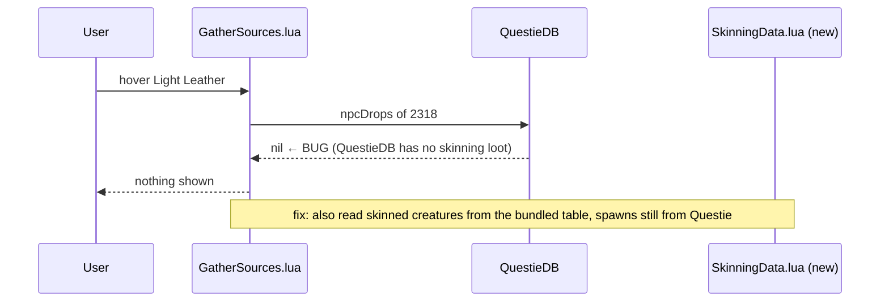

# sequenceDiagram

Captured 2026-11-18T11:40:19.272Z - run r-20261118-123147-aaa4

```mermaid
sequenceDiagram
    participant User
    participant G as GatherSources.lua
    participant Q as QuestieDB
    participant S as SkinningData.lua (new)
    User->>G: hover Light Leather
    G->>Q: npcDrops of 2318
    Q-->>G: nil  ← BUG (QuestieDB has no skinning loot)
    G-->>User: nothing shown
    Note over G,S: fix: also read skinned creatures from the bundled table, spawns still from Questie
```
