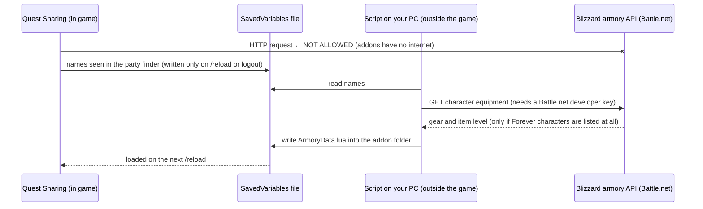

# sequenceDiagram

Captured 2026-11-18T21:45:19.218Z - run r-20261118-224506-cb02

```mermaid
sequenceDiagram
    participant Addon as Quest Sharing (in game)
    participant Disk as SavedVariables file
    participant App as Script on your PC (outside the game)
    participant API as Blizzard armory API (Battle.net)
    Addon-xAPI: HTTP request ← NOT ALLOWED (addons have no internet)
    Addon->>Disk: names seen in the party finder (written only on /reload or logout)
    App->>Disk: read names
    App->>API: GET character equipment (needs a Battle.net developer key)
    API-->>App: gear and item level (only if Forever characters are listed at all)
    App->>Disk: write ArmoryData.lua into the addon folder
    Disk-->>Addon: loaded on the next /reload
```
