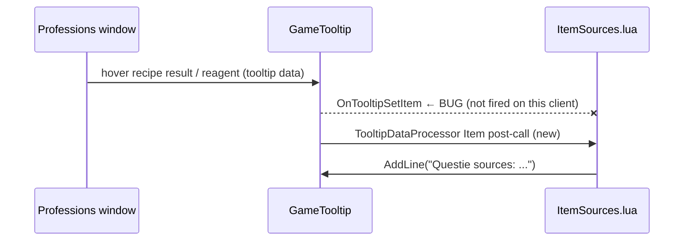

# sequenceDiagram

Captured 2026-11-18T10:30:23.767Z - run r-20261118-112401-ae26

```mermaid
sequenceDiagram
    participant Prof as Professions window
    participant TT as GameTooltip
    participant IS as ItemSources.lua
    Prof->>TT: hover recipe result / reagent (tooltip data)
    TT--xIS: OnTooltipSetItem  ← BUG (not fired on this client)
    TT->>IS: TooltipDataProcessor Item post-call (new)
    IS->>TT: AddLine("Questie sources: ...")
```
