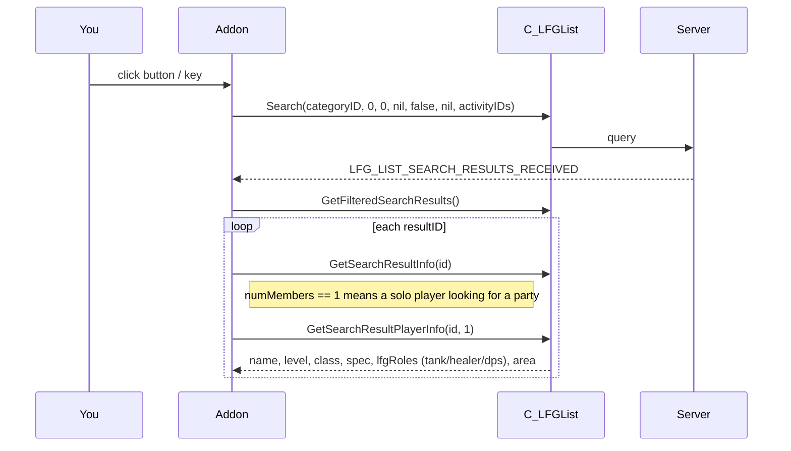

# sequenceDiagram

Captured 2026-11-18T20:34:03.211Z - run r-20261118-213337-eeba

```mermaid
sequenceDiagram
    participant You
    participant Addon
    participant API as C_LFGList
    participant Srv as Server
    You->>Addon: click button / key
    Addon->>API: Search(categoryID, 0, 0, nil, false, nil, activityIDs)
    API->>Srv: query
    Srv-->>Addon: LFG_LIST_SEARCH_RESULTS_RECEIVED
    Addon->>API: GetFilteredSearchResults()
    loop each resultID
        Addon->>API: GetSearchResultInfo(id)
        Note right of Addon: numMembers == 1 means a solo player looking for a party
        Addon->>API: GetSearchResultPlayerInfo(id, 1)
        API-->>Addon: name, level, class, spec, lfgRoles (tank/healer/dps), area
    end
```
