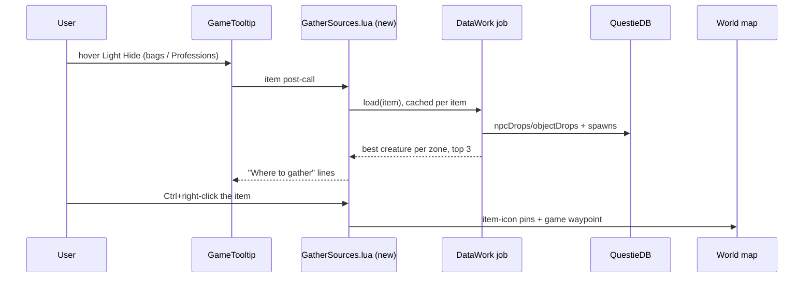

# sequenceDiagram

Captured 2026-11-18T10:53:04.175Z - run r-20261118-113922-96a9

```mermaid
sequenceDiagram
    participant User
    participant Tip as GameTooltip
    participant G as GatherSources.lua (new)
    participant Job as DataWork job
    participant DB as QuestieDB
    participant Map as World map
    User->>Tip: hover Light Hide (bags / Professions)
    Tip->>G: item post-call
    G->>Job: load(item), cached per item
    Job->>DB: npcDrops/objectDrops + spawns
    Job-->>G: best creature per zone, top 3
    G-->>Tip: "Where to gather" lines
    User->>G: Ctrl+right-click the item
    G->>Map: item-icon pins + game waypoint
```
