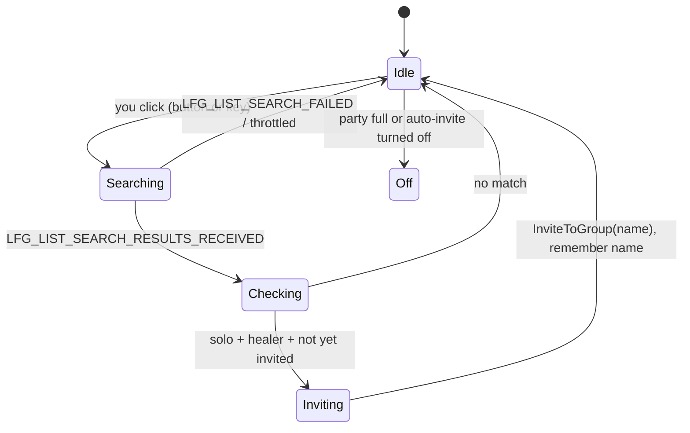

# stateDiagram-v2

Captured 2026-11-18T20:34:37.858Z - run r-20261118-213428-8e14

```mermaid
stateDiagram-v2
    [*] --> Idle
    Idle --> Searching : you click (button or key)
    Searching --> Checking : LFG_LIST_SEARCH_RESULTS_RECEIVED
    Searching --> Idle : LFG_LIST_SEARCH_FAILED / throttled
    Checking --> Inviting : solo + healer + not yet invited
    Checking --> Idle : no match
    Inviting --> Idle : InviteToGroup(name), remember name
    Idle --> Off : party full or auto-invite turned off
```
