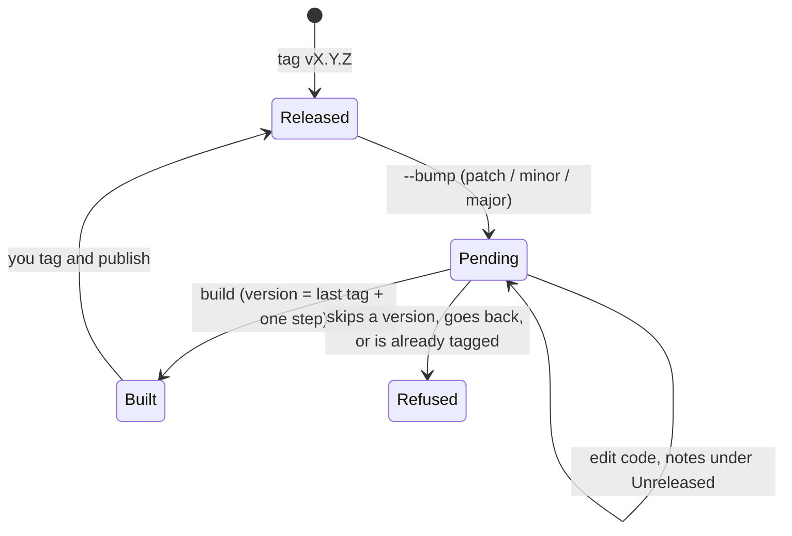

# stateDiagram-v2

Captured 2026-11-18T12:10:22.318Z - run r-20261118-130748-8a9b

```mermaid
stateDiagram-v2
    [*] --> Released: tag vX.Y.Z
    Released --> Pending: --bump (patch / minor / major)
    Pending --> Pending: edit code, notes under Unreleased
    Pending --> Built: build (version = last tag + one step)
    Built --> Released: you tag and publish
    Pending --> Refused: skips a version, goes back, or is already tagged
```
