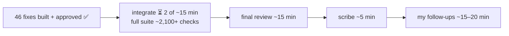

# flowchart

Captured 2026-11-19T10:11:43.850Z - run r-20261119-104206-0145

```mermaid
flowchart LR
  D["46 fixes built + approved ✅"] --> I["integrate ⏳ 2 of ~15 min<br/>full suite ~2,100+ checks"]
  I --> F["final review ~15 min"] --> S["scribe ~5 min"] --> M["my follow-ups ~15–20 min"]
```
