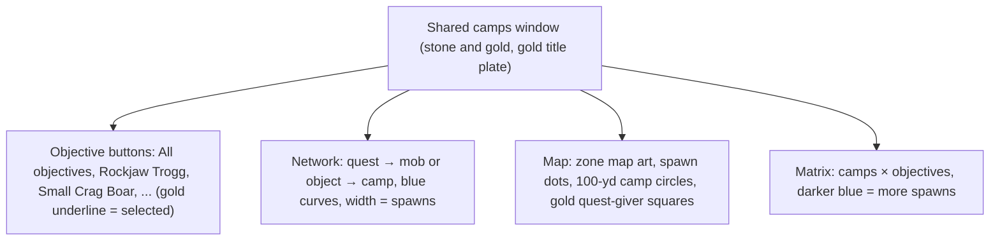

# flowchart

Captured 2026-11-19T13:43:44.732Z - run r-20261119-143429-1295

```mermaid
flowchart TB
    T["Shared camps window (stone and gold, gold title plate)"]
    T --> B["Objective buttons: All objectives, Rockjaw Trogg, Small Crag Boar, ... (gold underline = selected)"]
    T --> N["Network: quest → mob or object → camp, blue curves, width = spawns"]
    T --> M["Map: zone map art, spawn dots, 100-yd camp circles, gold quest-giver squares"]
    T --> X["Matrix: camps × objectives, darker blue = more spawns"]
```
