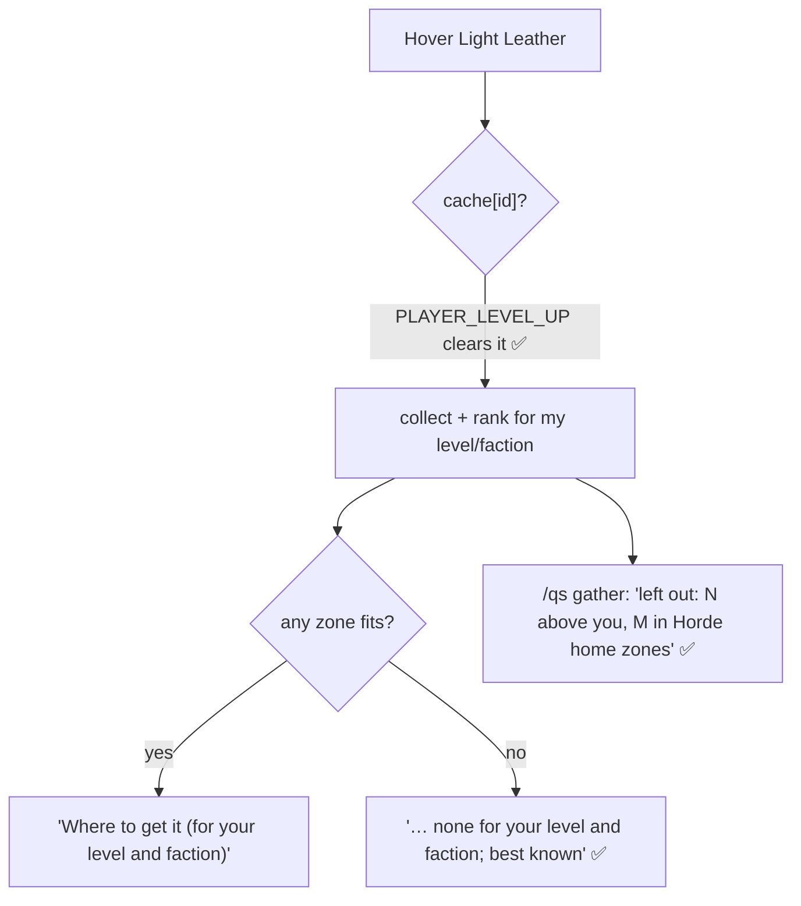

# flowchart

Captured 2026-11-19T09:25:38.324Z - run r-20261119-095449-ea8e

```mermaid
flowchart TD
    Hover[Hover Light Leather] --> Cache{"cache[id]?"}
    Cache -- "PLAYER_LEVEL_UP clears it ✅" --> Job[collect + rank for my level/faction]
    Job --> Fits{any zone fits?}
    Fits -- yes --> H1["'Where to get it (for your level and faction)'"]
    Fits -- no --> H2["'… none for your level and faction; best known' ✅"]
    Job --> Cmd["/qs gather: 'left out: N above you, M in Horde home zones' ✅"]
```
