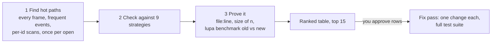

# flowchart

Captured 2026-11-19T08:38:42.181Z - run r-20261119-093725-231a

```mermaid
flowchart LR
    S1["1 Find hot paths<br/>every frame, frequent events,<br/>per-id scans, once per open"] --> S2["2 Check against 9 strategies"]
    S2 --> S3["3 Prove it<br/>file:line, size of n,<br/>lupa benchmark old vs new"]
    S3 --> Out["Ranked table, top 15"]
    Out -->|you approve rows| Fix["Fix pass: one change each,<br/>full test suite"]
```
