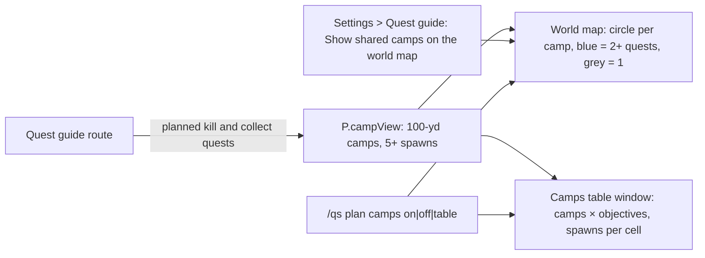

# flowchart

Captured 2026-11-19T12:44:17.155Z - run r-20261119-133356-3785

```mermaid
flowchart LR
    Guide[Quest guide route] -->|planned kill and collect quests| View[P.campView: 100-yd camps, 5+ spawns]
    View --> Map[World map: circle per camp, blue = 2+ quests, grey = 1]
    View --> Table[Camps table window: camps × objectives, spawns per cell]
    Switch[Settings > Quest guide: Show shared camps on the world map] --> Map
    Cmd["/qs plan camps on|off|table"] --> Map & Table
```
