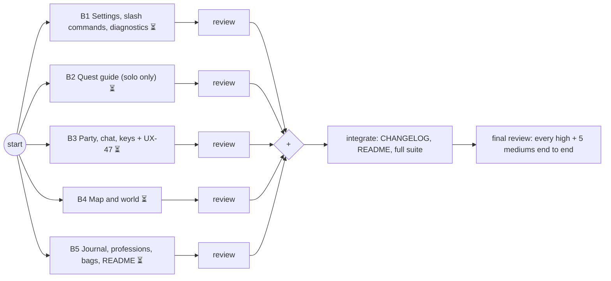

# flowchart

Captured 2026-11-19T09:42:27.164Z - run r-20261119-104206-0145

```mermaid
flowchart LR
  S((start)) --> B1["B1 Settings, slash commands, diagnostics ⏳"] --> R1["review"] --> J{"+"}
  S --> B2["B2 Quest guide (solo only) ⏳"] --> R2["review"] --> J
  S --> B3["B3 Party, chat, keys + UX-47 ⏳"] --> R3["review"] --> J
  S --> B4["B4 Map and world ⏳"] --> R4["review"] --> J
  S --> B5["B5 Journal, professions, bags, README ⏳"] --> R5["review"] --> J
  J --> I["integrate: CHANGELOG, README, full suite"] --> F["final review: every high + 5 mediums end to end"]
```
