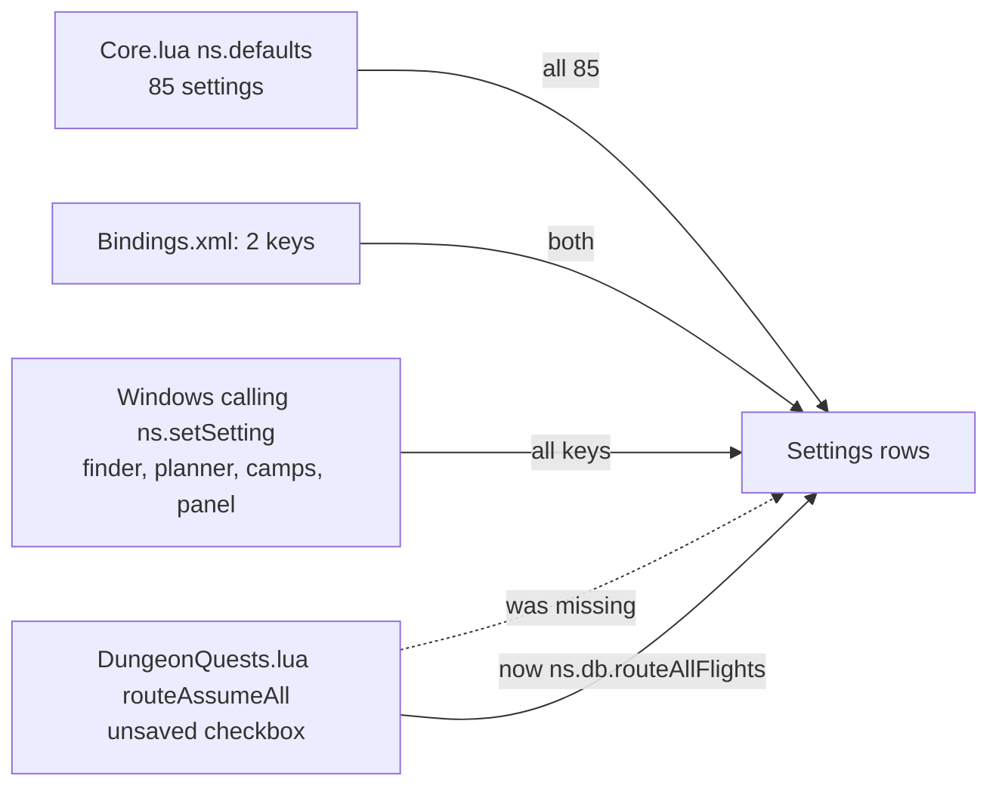

# flowchart

Captured 2026-11-19T13:36:10.192Z - run r-20261119-143157-3c8d

```mermaid
flowchart LR
    D["Core.lua ns.defaults<br/>85 settings"] -->|all 85| S[Settings rows]
    K["Bindings.xml: 2 keys"] -->|both| S
    W["Windows calling ns.setSetting<br/>finder, planner, camps, panel"] -->|all keys| S
    R["DungeonQuests.lua routeAssumeAll<br/>unsaved checkbox"] -.->|was missing| S
    R -->|now ns.db.routeAllFlights| S
```
