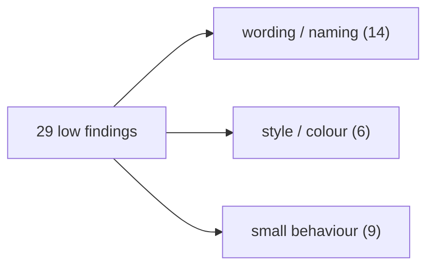

# flowchart

Captured 2026-11-19T10:37:13.748Z - run r-20261119-113646-f330

```mermaid
flowchart LR
  L["29 low findings"] --> W["wording / naming (14)"]
  L --> S["style / colour (6)"]
  L --> B["small behaviour (9)"]
```
