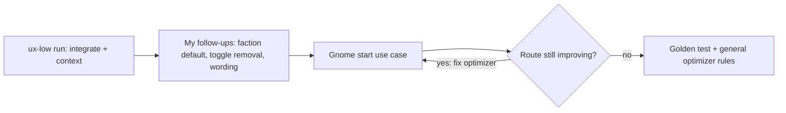

# flowchart

Captured 2026-11-19T10:57:27.135Z - run r-20261119-113937-c955

```mermaid
flowchart LR
    A[ux-low run: integrate + context] --> B[My follow-ups: faction default, toggle removal, wording]
    B --> C[Gnome start use case]
    C --> D{Route still improving?}
    D -- yes: fix optimizer --> C
    D -- no --> E[Golden test + general optimizer rules]
```
