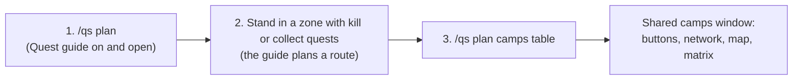

# flowchart

Captured 2026-11-19T14:08:42.700Z - run r-20261119-150817-ac58

```mermaid
flowchart LR
    A["1. /qs plan<br/>(Quest guide on and open)"] --> B["2. Stand in a zone with kill or collect quests<br/>(the guide plans a route)"]
    B --> C["3. /qs plan camps table"]
    C --> D[Shared camps window:<br/>buttons, network, map, matrix]
```
