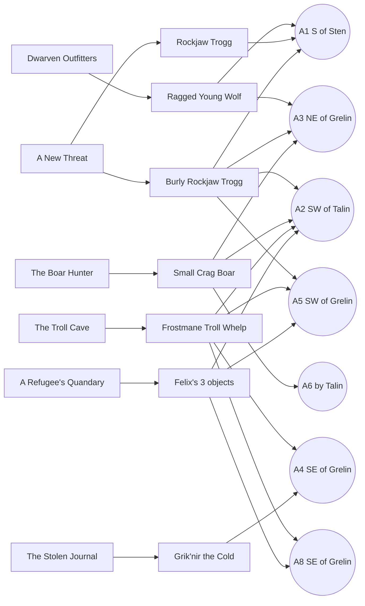

# flowchart

Captured 2026-11-19T12:14:40.648Z - run r-20261119-131122-7ef0

```mermaid
flowchart LR
    DO[Dwarven Outfitters] --> W[Ragged Young Wolf]
    NT[A New Threat] --> RT[Rockjaw Trogg]
    NT --> BT[Burly Rockjaw Trogg]
    BH[The Boar Hunter] --> B[Small Crag Boar]
    TC[The Troll Cave] --> WH[Frostmane Troll Whelp]
    SJ[The Stolen Journal] --> GK["Grik'nir the Cold"]
    RQ["A Refugee's Quandary"] --> FX[Felix's 3 objects]
    W --> A1((A1 S of Sten)) & A3((A3 NE of Grelin))
    RT --> A1
    BT --> A1 & A2((A2 SW of Talin)) & A3 & A5((A5 SW of Grelin))
    B --> A2 & A3 & A6((A6 by Talin))
    WH --> A2 & A4((A4 SE of Grelin)) & A5 & A8((A8 SE of Grelin))
    GK --> A4
    FX --> A2 & A5 & A8
```
