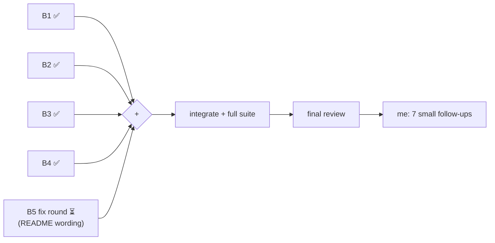

# flowchart

Captured 2026-11-19T10:05:48.843Z - run r-20261119-104206-0145

```mermaid
flowchart LR
  B1["B1 ✅"] --> J{"+"}
  B2["B2 ✅"] --> J
  B3["B3 ✅"] --> J
  B4["B4 ✅"] --> J
  B5["B5 fix round ⏳<br/>(README wording)"] --> J
  J --> I["integrate + full suite"] --> F["final review"]
  F --> M["me: 7 small follow-ups"]
```
