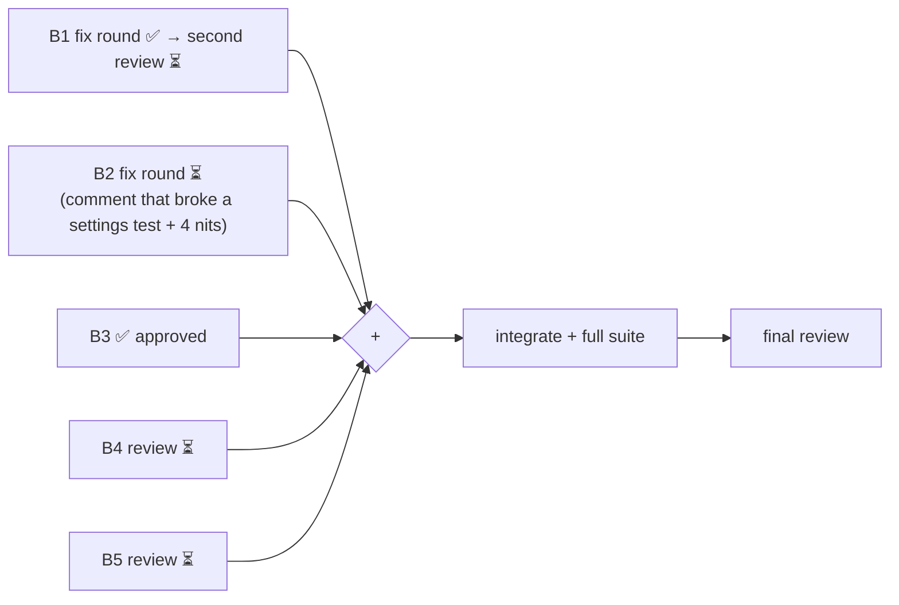

# flowchart

Captured 2026-11-19T10:00:46.075Z - run r-20261119-104206-0145

```mermaid
flowchart LR
  B1["B1 fix round ✅ → second review ⏳"] --> J{"+"}
  B2["B2 fix round ⏳<br/>(comment that broke a settings test + 4 nits)"] --> J
  B3["B3 ✅ approved"] --> J
  B4["B4 review ⏳"] --> J
  B5["B5 review ⏳"] --> J
  J --> I["integrate + full suite"] --> F["final review"]
```
