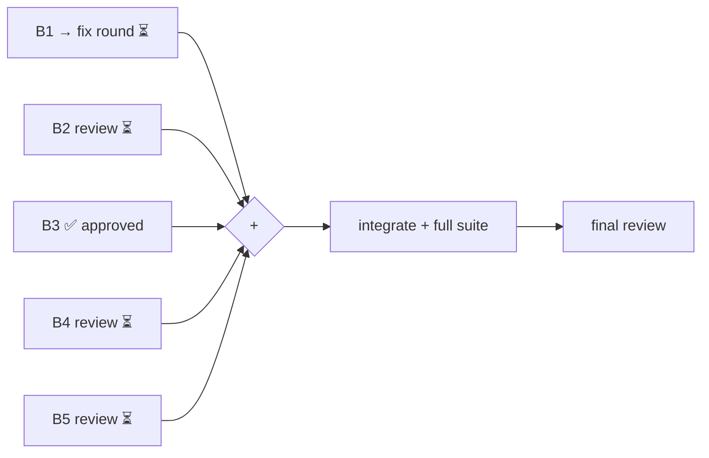

# flowchart

Captured 2026-11-19T09:58:43.647Z - run r-20261119-104206-0145

```mermaid
flowchart LR
  B1["B1 → fix round ⏳"] --> J{"+"}
  B2["B2 review ⏳"] --> J
  B3["B3 ✅ approved"] --> J
  B4["B4 review ⏳"] --> J
  B5["B5 review ⏳"] --> J
  J --> I["integrate + full suite"] --> F["final review"]
```
