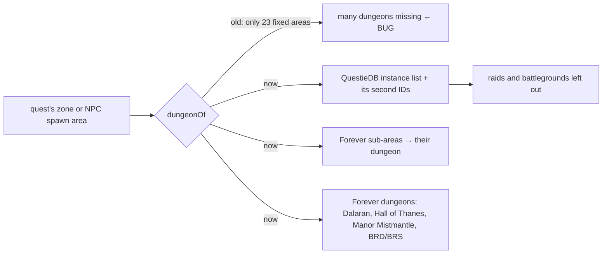

# flowchart

Captured 2026-11-19T14:17:16.649Z - run r-20261119-151124-407e

```mermaid
flowchart LR
    A[quest's zone or NPC spawn area] --> D{dungeonOf}
    D -->|old: only 23 fixed areas| X[many dungeons missing ← BUG]
    D -->|now| L[QuestieDB instance list + its second IDs]
    D -->|now| S[Forever sub-areas → their dungeon]
    D -->|now| F[Forever dungeons: Dalaran, Hall of Thanes, Manor Mistmantle, BRD/BRS]
    L --> R[raids and battlegrounds left out]
```
