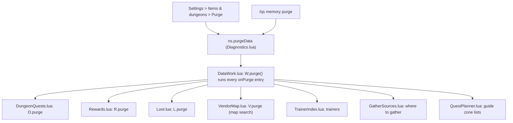

# flowchart

Captured 2026-11-19T10:16:12.877Z - run r-20261119-110822-331d

```mermaid
flowchart TD
    Settings["Settings > Items & dungeons > Purge"] --> PD["ns.purgeData (Diagnostics.lua)"]
    Slash["/qs memory purge"] --> PD
    PD --> W["DataWork.lua: W.purge() runs every onPurge entry"]
    W --> DQ["DungeonQuests.lua: D.purge"]
    W --> R["Rewards.lua: R.purge"]
    W --> L["Loot.lua: L.purge"]
    W --> V["VendorMap.lua: V.purge (map search)"]
    W --> T["TrainerIndex.lua: trainers"]
    W --> G["GatherSources.lua: where to gather"]
    W --> P["QuestPlanner.lua: guide zone lists"]
```
