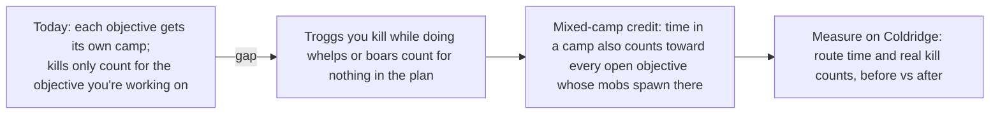

# flowchart

Captured 2026-11-19T13:46:09.668Z - run r-20261119-144551-d73a

```mermaid
flowchart LR
    Now["Today: each objective gets its own camp;<br/>kills only count for the objective you're working on"] -->|gap| Gap["Troggs you kill while doing whelps or boars count for nothing in the plan"]
    Gap --> Fix["Mixed-camp credit: time in a camp also counts toward every open objective whose mobs spawn there"]
    Fix --> Test["Measure on Coldridge: route time and real kill counts, before vs after"]
```
