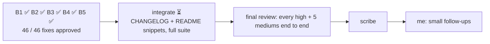

# flowchart

Captured 2026-11-19T10:09:23.860Z - run r-20261119-104206-0145

```mermaid
flowchart LR
  B["B1 ✅ B2 ✅ B3 ✅ B4 ✅ B5 ✅<br/>46 / 46 fixes approved"] --> I["integrate ⏳<br/>CHANGELOG + README snippets, full suite"]
  I --> F["final review: every high + 5 mediums end to end"]
  F --> S["scribe"] --> M["me: small follow-ups"]
```
