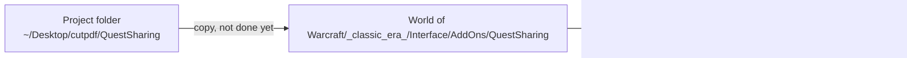

# flowchart

Captured 2026-11-19T14:09:42.520Z - run r-20261119-150925-8b0e

```mermaid
flowchart LR
    P["Project folder<br/>~/Desktop/cutpdf/QuestSharing"] -->|copy, not done yet| G["World of Warcraft/_classic_era_/Interface/AddOns/QuestSharing"]
    G --> R["/reload in game"] --> W["/qs plan → /qs plan camps table"]
```
