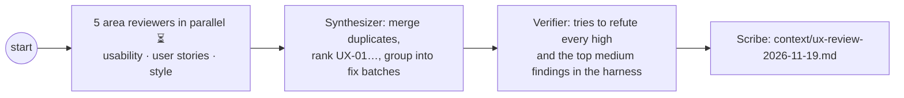

# flowchart

Captured 2026-11-19T08:55:11.240Z - run r-20261119-095317-8986

```mermaid
flowchart LR
  S((start)) --> R["5 area reviewers in parallel ⏳<br/>usability · user stories · style"]
  R --> Y["Synthesizer: merge duplicates,<br/>rank UX-01…, group into fix batches"]
  Y --> V["Verifier: tries to refute every high<br/>and the top medium findings in the harness"]
  V --> W["Scribe: context/ux-review-2026-11-19.md"]
```
