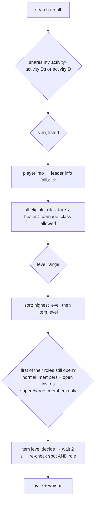

# flowchart

Captured 2026-11-19T08:58:28.245Z - run r-20261119-095124-e0de

```mermaid
flowchart TD
    R[search result] --> A{shares my activity?<br/>activityIDs or activityID}
    A --> S{solo, listed}
    S --> P[player info → leader info fallback]
    P --> Roles[all eligible roles: tank > healer > damage, class allowed]
    Roles --> Lvl{level range}
    Lvl --> Sort[sort: highest level, then item level]
    Sort --> Pick{first of their roles still open?<br/>normal: members + open invites<br/>supercharge: members only}
    Pick --> D[item level decide → wait 2 s → re-check spot AND role]
    D --> I[invite + whisper]
```
