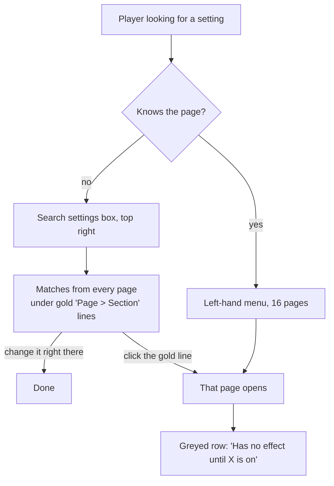

# flowchart

Captured 2026-11-19T08:48:00.949Z - run r-20261119-094147-c8f2

```mermaid
flowchart TD
    U[Player looking for a setting] --> Q{Knows the page?}
    Q -- no --> S[Search settings box, top right] --> R["Matches from every page<br/>under gold 'Page > Section' lines"]
    R -->|change it right there| Done
    R -->|click the gold line| P[That page opens]
    Q -- yes --> N[Left-hand menu, 16 pages] --> P
    P --> G["Greyed row: 'Has no effect until X is on'"]
```
