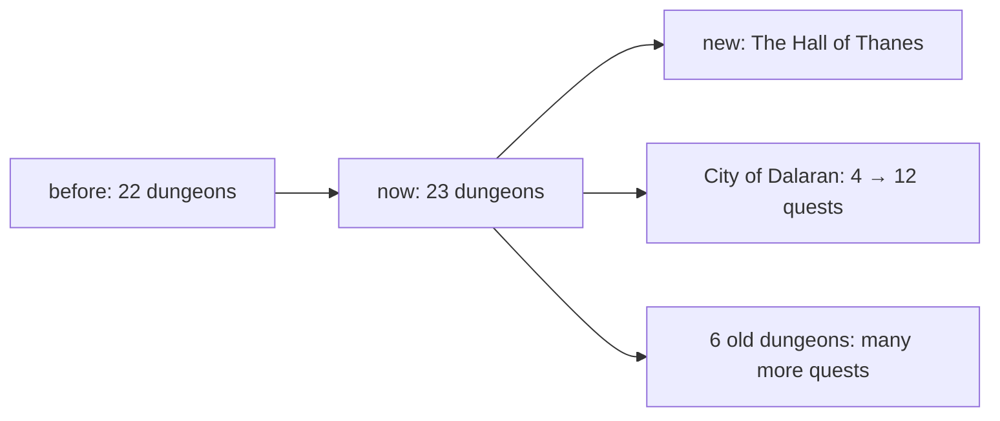

# flowchart

Captured 2026-11-19T14:42:18.030Z - run r-20261119-154117-fcdd

```mermaid
flowchart LR
    O["before: 22 dungeons"] --> N["now: 23 dungeons"]
    N --> A["new: The Hall of Thanes"]
    N --> B["City of Dalaran: 4 → 12 quests"]
    N --> C["6 old dungeons: many more quests"]
```
