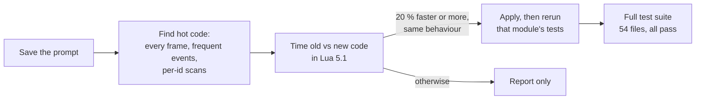

# flowchart

Captured 2026-11-19T08:52:51.658Z - run r-20261119-094523-f661

```mermaid
flowchart LR
    P["Save the prompt"] --> H["Find hot code:<br/>every frame, frequent events,<br/>per-id scans"]
    H --> B["Time old vs new code<br/>in Lua 5.1"]
    B -->|"20 % faster or more,<br/>same behaviour"| A["Apply, then rerun<br/>that module's tests"]
    B -->|"otherwise"| R["Report only"]
    A --> T["Full test suite<br/>54 files, all pass"]
```
