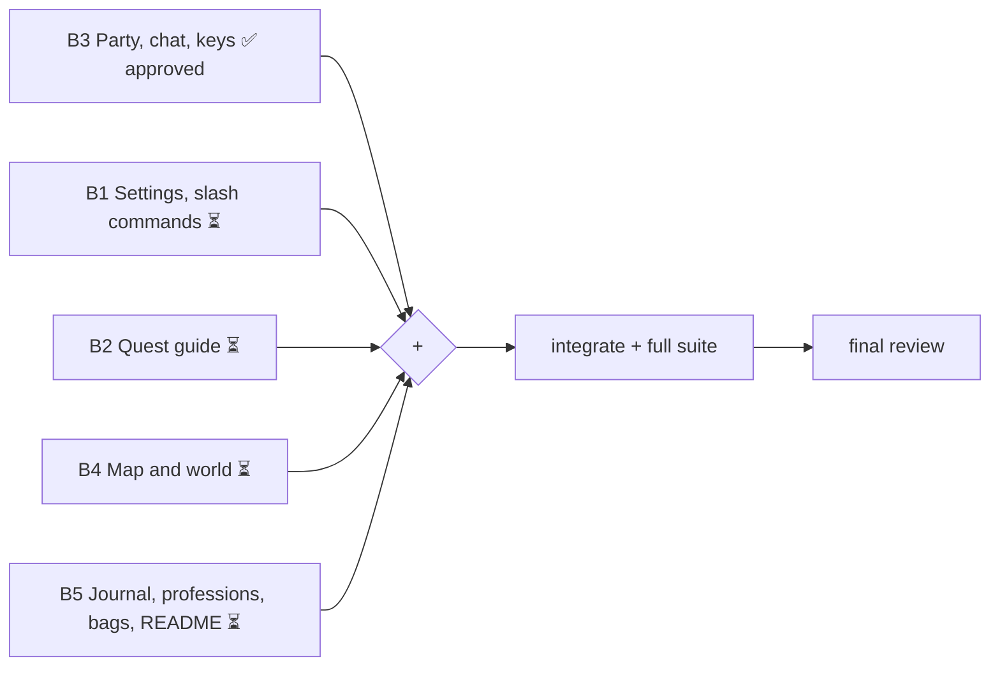

# flowchart

Captured 2026-11-19T09:53:09.857Z - run r-20261119-104206-0145

```mermaid
flowchart LR
  B3["B3 Party, chat, keys ✅ approved"] --> J{"+"}
  B1["B1 Settings, slash commands ⏳"] --> J
  B2["B2 Quest guide ⏳"] --> J
  B4["B4 Map and world ⏳"] --> J
  B5["B5 Journal, professions, bags, README ⏳"] --> J
  J --> I["integrate + full suite"] --> F["final review"]
```
