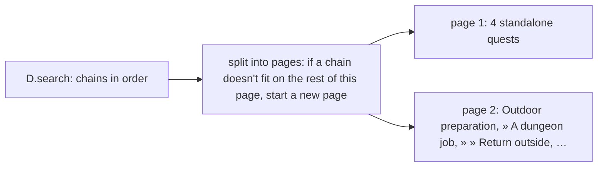

# flowchart

Captured 2026-11-19T09:01:24.659Z - run r-20261119-095449-ea8e

```mermaid
flowchart LR
    S[D.search: chains in order] --> G["split into pages: if a chain doesn't fit on the rest of this page, start a new page"]
    G --> P1["page 1: 4 standalone quests"]
    G --> P2["page 2: Outdoor preparation, » A dungeon job, » » Return outside, …"]
```
