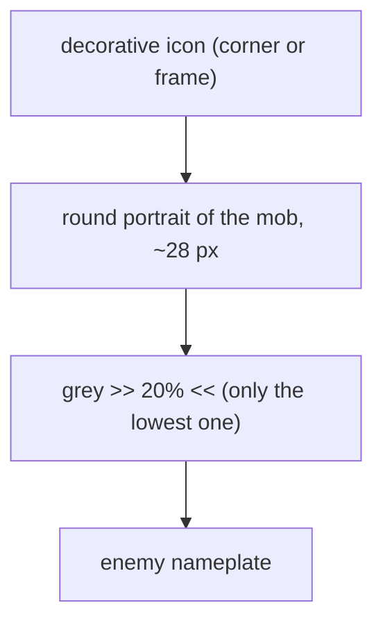

# flowchart

Captured 2026-11-19T09:45:02.088Z - run r-20261119-104444-ab22

```mermaid
flowchart TD
    Icon["decorative icon (corner or frame)"] --> Portrait["round portrait of the mob, ~28 px"]
    Portrait --> Num["grey >> 20% << (only the lowest one)"]
    Num --> Plate[enemy nameplate]
```
