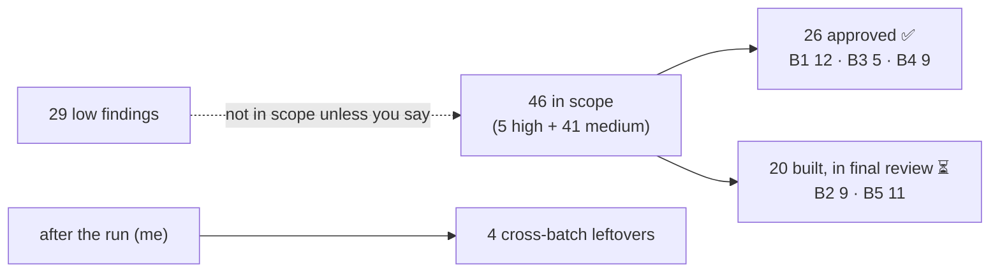

# flowchart

Captured 2026-11-19T10:04:20.309Z - run r-20261119-104206-0145

```mermaid
flowchart LR
  T["46 in scope<br/>(5 high + 41 medium)"] --> A["26 approved ✅<br/>B1 12 · B3 5 · B4 9"]
  T --> R["20 built, in final review ⏳<br/>B2 9 · B5 11"]
  X["after the run (me)"] --> F["4 cross-batch leftovers"]
  L["29 low findings"] -.->|"not in scope unless you say"| T
```
