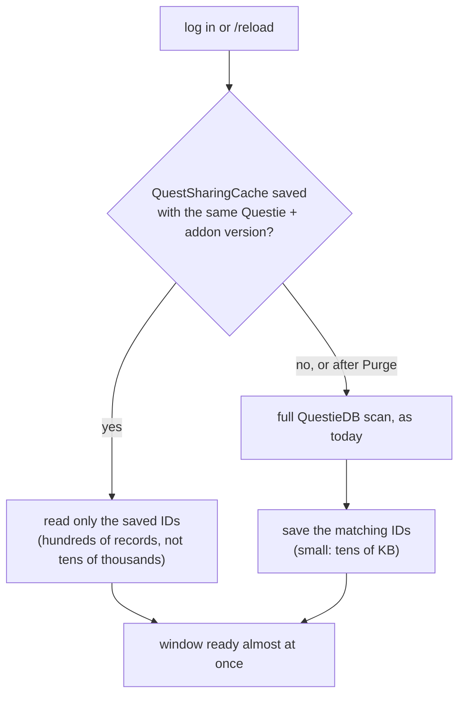

# flowchart

Captured 2026-11-19T10:23:23.136Z - run r-20261119-112259-c5ea

```mermaid
flowchart TD
    Login["log in or /reload"] --> Check{"QuestSharingCache saved<br/>with the same Questie + addon version?"}
    Check -- yes --> Fast["read only the saved IDs<br/>(hundreds of records, not tens of thousands)"]
    Check -- "no, or after Purge" --> Full["full QuestieDB scan, as today"]
    Full --> Save["save the matching IDs<br/>(small: tens of KB)"]
    Fast --> Ready["window ready almost at once"]
    Save --> Ready
```
