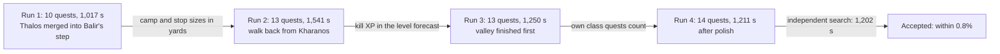

# flowchart

Captured 2026-11-19T11:45:33.115Z - run r-20261119-122636-561b

```mermaid
flowchart LR
    R1["Run 1: 10 quests, 1,017 s<br/>Thalos merged into Balir's step"] -->|camp and stop sizes in yards| R2["Run 2: 13 quests, 1,541 s<br/>walk back from Kharanos"]
    R2 -->|kill XP in the level forecast| R3["Run 3: 13 quests, 1,250 s<br/>valley finished first"]
    R3 -->|own class quests count| R4["Run 4: 14 quests, 1,211 s after polish"]
    R4 -->|independent search: 1,202 s| OK["Accepted: within 0.8%"]
```
