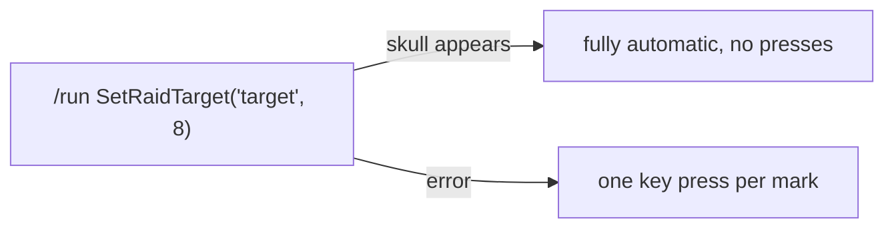

# flowchart

Captured 2026-11-19T10:16:01.435Z - run r-20261119-111548-a783

```mermaid
flowchart LR
    Test["/run SetRaidTarget('target', 8)"] -->|skull appears| Auto[fully automatic, no presses]
    Test -->|error| Key[one key press per mark]
```
