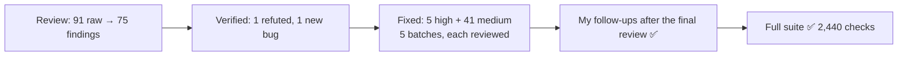

# flowchart

Captured 2026-11-19T10:28:43.936Z - run none

```mermaid
flowchart LR
  R["Review: 91 raw → 75 findings"] --> V["Verified: 1 refuted, 1 new bug"]
  V --> F["Fixed: 5 high + 41 medium<br/>5 batches, each reviewed"]
  F --> M["My follow-ups after the final review ✅"]
  M --> T["Full suite ✅ 2,440 checks"]
```
