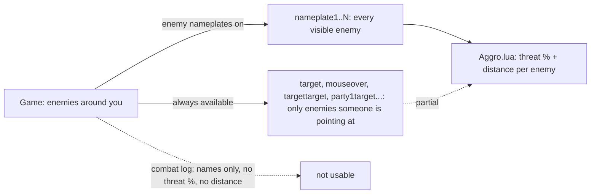

# flowchart

Captured 2026-11-19T08:28:33.510Z - run r-20261119-092817-2ed9

```mermaid
flowchart LR
    Game[Game: enemies around you] -->|enemy nameplates on| Plates["nameplate1..N: every visible enemy"]
    Game -->|always available| Few["target, mouseover, targettarget, party1target...: only enemies someone is pointing at"]
    Plates --> Aggro[Aggro.lua: threat % + distance per enemy]
    Few -.->|partial| Aggro
    Game -.->|combat log: names only, no threat %, no distance| X[not usable]
```
