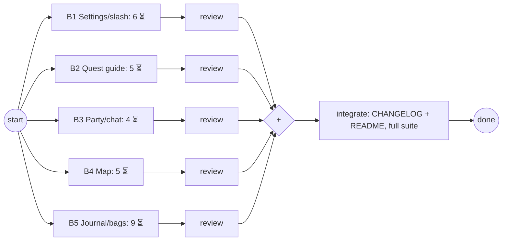

# flowchart

Captured 2026-11-19T10:39:54.695Z - run r-20261119-113902-9cc1

```mermaid
flowchart LR
  S((start)) --> B1["B1 Settings/slash: 6 ⏳"] --> R1["review"] --> J{"+"}
  S --> B2["B2 Quest guide: 5 ⏳"] --> R2["review"] --> J
  S --> B3["B3 Party/chat: 4 ⏳"] --> R3["review"] --> J
  S --> B4["B4 Map: 5 ⏳"] --> R4["review"] --> J
  S --> B5["B5 Journal/bags: 9 ⏳"] --> R5["review"] --> J
  J --> I["integrate: CHANGELOG + README, full suite"] --> E((done))
```
