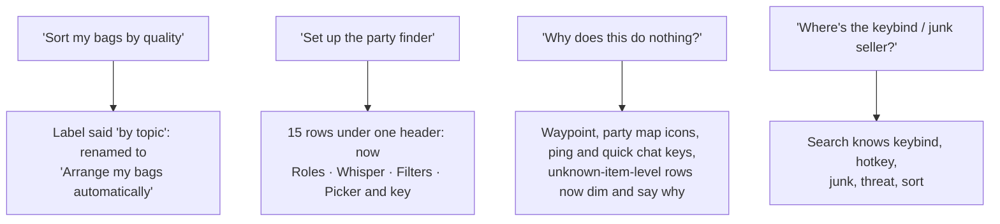

# flowchart

Captured 2026-11-19T13:40:40.192Z - run r-20261119-143634-3da1

```mermaid
flowchart TD
    US1["'Sort my bags by quality'"] --> F1["Label said 'by topic': renamed to<br/>'Arrange my bags automatically'"]
    US2["'Set up the party finder'"] --> F2["15 rows under one header: now<br/>Roles · Whisper · Filters · Picker and key"]
    US3["'Why does this do nothing?'"] --> F3["Waypoint, party map icons, ping and quick chat keys,<br/>unknown-item-level rows now dim and say why"]
    US4["'Where's the keybind / junk seller?'"] --> F4["Search knows keybind, hotkey,<br/>junk, threat, sort"]
```
