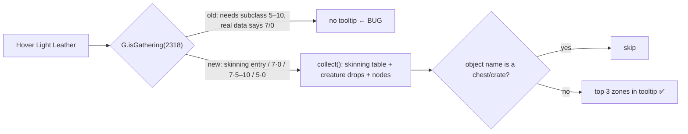

# flowchart

Captured 2026-11-19T08:58:09.952Z - run r-20261119-095229-5950

```mermaid
flowchart LR
    H[Hover Light Leather] --> I{"G.isGathering(2318)"}
    I -- "old: needs subclass 5–10, real data says 7/0" --> X["no tooltip ← BUG"]
    I -- "new: skinning entry / 7·0 / 7·5–10 / 5·0" --> C["collect(): skinning table + creature drops + nodes"]
    C --> F{object name is a chest/crate?}
    F -- yes --> S[skip]
    F -- no --> T["top 3 zones in tooltip ✅"]
```
