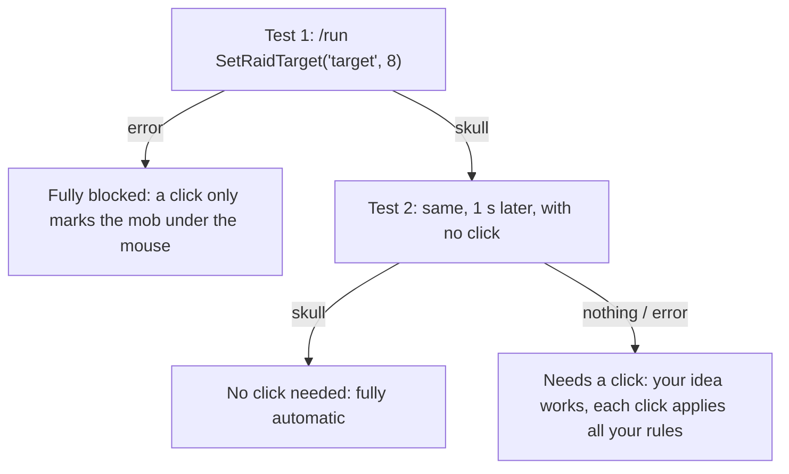

# flowchart

Captured 2026-11-19T10:17:41.553Z - run r-20261119-111725-a837

```mermaid
flowchart TD
    A["Test 1: /run SetRaidTarget('target', 8)"] -->|error| P["Fully blocked: a click only marks the mob under the mouse"]
    A -->|skull| B["Test 2: same, 1 s later, with no click"]
    B -->|skull| Auto["No click needed: fully automatic"]
    B -->|nothing / error| Click["Needs a click: your idea works, each click applies all your rules"]
```
